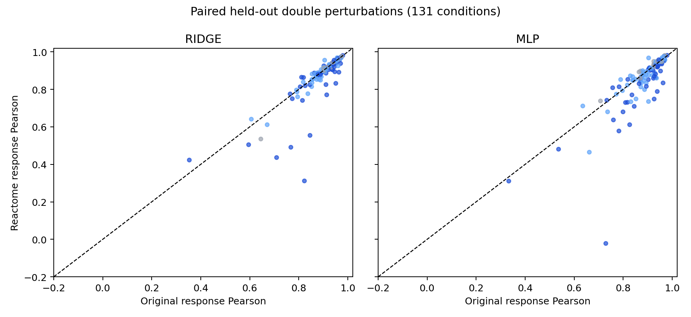

# Reactome pathway knowledge in the K562 perturbation benchmark

## 中文速览

Reactome 通路成员关系作为额外扰动特征，沿用原来的五折、
131 个双基因测试组合。它是静态知识，**没有测量 K562 细胞内的蛋白含量**。
通路表覆盖 105 个扰动基因中的 66 个。加入通路后，Ridge 的响应 Pearson 从
0.8963 降至
0.8784；MLP 从
0.8913 降至
0.8640。
三个随机打乱通路对应关系的对照也没有支持“真实通路关系能带来增益”。
两个模型的平均表现均低于身份特征基线。配置为 `configs/reactome_pathway.json`，
逐条件指标、配对差异和覆盖统计保存在 `results/pathway_knowledge/`。

## What was added

This is **static protein/pathway knowledge**, not measured protein abundance or
activity in the Norman K562 cells. The source is the [official Reactome human
pathway GMT](https://reactome.org/download/current/ReactomePathways.gmt.zip),
downloaded once and identified by SHA256 `8c1dbc8578431da5d2d5118262718c60b553a9be3398e93658daa069e4a9afd4`.

Each perturbation retains its original 105-dimensional gene-identity vector.
For each retained pathway, we add (1) a binary feature that either perturbed
gene belongs to it and (2) a binary feature that both genes belong to it.
Pathways with identical membership among the 105 target genes are collapsed.
The fixed filter retains pathways with 2–30 represented target genes. This
produces 130 distinct pathway patterns and
365 total input features. All features use public annotations
and gene names only; no RNA target or test metric is used to select them.

Reactome annotates 66 of 105
perturbation genes under this filter. The other
39 keep only their
identity features. Among 131 tested double combinations,
15 have neither gene annotated,
60 have one,
56 have both, and
36 share a retained pathway.

## Protocol

- Reuse the original five folds and 2,000-gene pseudobulk targets. Each of the
  131 double combinations is tested exactly once. The previous identity-only
  Ridge and MLP runs are reused without retraining.
- Keep the same Ridge alpha candidates, validation selection, train-plus-validation
  refit, MLP architecture, optimizer, seed, and early stopping as the original runs.
- Fit two added-feature models: Ridge + Reactome and MLP + Reactome.
- Train three negative controls per model. Each permutes the Reactome annotation
  rows across the 105 genes with a fixed seed (1001, 1002, 1003), preserving
  feature dimensions and pathway frequencies while breaking the correct mapping.
- Report test metrics as macro averages over the same 131 conditions. Paired
  bootstrap intervals resample these conditions; shared component genes and
  batches mean the intervals are descriptive, not an independent-cohort test.

## Results

Lower MSE is better; higher Pearson and top-100 recovery are better.
`shuffle_mean` averages the three negative-control predictions' **metrics**
per condition. It is not an ensembled prediction.

| model | pearson_delta | mse_all | top_100_recovery |
| --- | --- | --- | --- |
| ridge | 0.8963 | 0.0020 | 0.7204 |
| ridge_reactome | 0.8784 | 0.0023 | 0.7085 |
| ridge_shuffle_mean | 0.8860 | 0.0022 | 0.7085 |
| mlp | 0.8913 | 0.0020 | 0.7224 |
| mlp_reactome | 0.8640 | 0.0024 | 0.6998 |
| mlp_shuffle_mean | 0.8764 | 0.0024 | 0.7074 |

The differences below are `model_a - model_b`; positive response Pearson favors
`model_a`.

| model_a | model_b | mean_a_minus_b | ci_low | ci_high |
| --- | --- | --- | --- | --- |
| ridge_reactome | ridge | -0.0179 | -0.0302 | -0.0077 |
| mlp_reactome | mlp | -0.0273 | -0.0429 | -0.0149 |
| ridge_reactome | ridge_shuffle_mean | -0.0076 | -0.0207 | +0.0033 |
| mlp_reactome | mlp_shuffle_mean | -0.0124 | -0.0294 | +0.0006 |



## Annotation coverage

The table shows the change in response Pearson relative to each identity-only
model. Coverage groups are descriptive and are not separately tuned models.

| model | group | n_conditions | mean_pearson_change | fraction_improved |
| --- | --- | --- | --- | --- |
| ridge | none | 15 | -0.0067 | 66.7% |
| ridge | one | 60 | -0.0035 | 38.3% |
| ridge | both | 56 | -0.0364 | 33.9% |
| ridge | shared | 36 | -0.0595 | 16.7% |
| ridge | both_no_shared | 20 | +0.0053 | 65.0% |
| mlp | none | 15 | +0.0086 | 66.7% |
| mlp | one | 60 | -0.0148 | 38.3% |
| mlp | both | 56 | -0.0503 | 25.0% |
| mlp | shared | 36 | -0.0683 | 19.4% |
| mlp | both_no_shared | 20 | -0.0178 | 35.0% |

## Interpretation

In this implementation, adding Reactome pathway membership **did not improve**
the primary five-fold benchmark. Both models are worse than their identity-only
versions on average. Correct annotations also do not outperform the three
shuffled mappings on average. The result is evidence against this particular
feature design as an improvement for this small K562 pseudobulk task, not
evidence that protein biology is uninformative.

The prior is sparse for these target genes, pathway membership is broad and
context independent, and it does not encode whether a protein is expressed,
phosphorylated, activated, or inhibited in K562. Shared pathway membership
also does not specify the direction of a double-perturbation interaction.
Additional input columns can make fitting harder even when they are biologically
plausible. The 131 test conditions were already used in the earlier V0.2
benchmark; this is a secondary comparison, not a new untouched external test.

## Reproduce

Run from the repository root after installing the dependencies in the README:

```powershell
conda activate mini_vc
python scripts/download_reactome.py
python scripts/train_reactome.py
python scripts/summarize_reactome.py
```

The archive is kept in `data/external/reactome/` and ignored by Git. Final CSV
tables are included in `results/pathway_knowledge/`; pathway audits and model
checkpoints are generated locally by the commands above.
