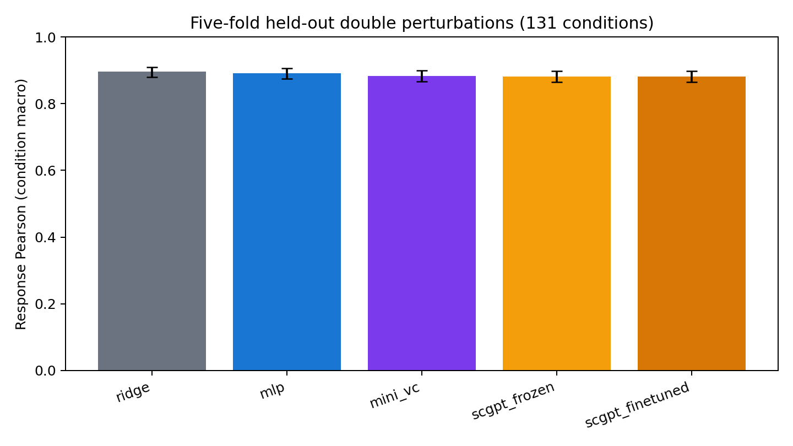
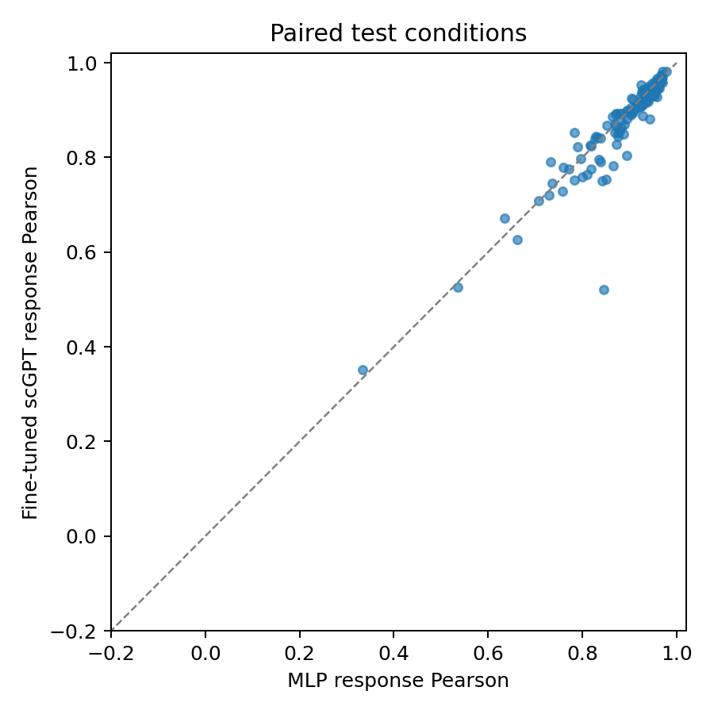

# scGPT five-fold K562 perturbation benchmark

## Protocol

- Norman 2019 K562 CRISPRa data; the same 2,000-gene pseudobulk target as V0.1.
- Five complete-condition folds: 26 or 27 unseen double perturbations per fold; every one of the 131 doubles is tested once. All component singles remain in training.
- Fold-specific training cells select HVGs. Validation conditions select checkpoints. Test conditions never select hyperparameters.
- Frozen scGPT and partial fine-tuning use the same control cells, gene mapping, action adapter, prediction head, and optimizer settings for the head. Fine-tuning updates the last two transformer layers at a lower learning rate.
- This is a transfer experiment using the official pretrained scGPT encoder with a new condition-level perturbation head. It is not a claim to reproduce scGPT's published perturbation benchmark end to end.
- Each scGPT context uses four real control cells from the matching split and gemgroup; 512 train-selected genes are quantile binned for the 51-bin checkpoint. The response target is still the average of separate perturbed cells, not a paired-cell trajectory.
- The released FlashMHA Wqkv weights are mapped to PyTorch MultiheadAttention in_proj weights. All 153 of 153 encoder parameter tensors were loaded. Checkpoint SHA256: `6cb5d451ab5c4b33eb673adbe4fddc61d2389df1b89b7651a9fe2e557572b922`.
- Perturbation gene coverage: 102 of 105. ELMSAN1 maps to its approved symbol MIDEAS. OOV genes C19orf26, C3orf72, KIAA1804 use separately trainable embeddings in both scGPT arms.

## Results across all 131 held-out combinations

The table is a macro average over all 131 test conditions. Intervals in the CSV are condition-level bootstrap intervals; they describe variation across this dataset and are not external-cohort validation.

| model | pearson_delta | mse_all | top_20_recovery | top_100_recovery |
| --- | --- | --- | --- | --- |
| ridge | 0.896344 | 0.002015 | 0.718702 | 0.720382 |
| mlp | 0.891277 | 0.001982 | 0.711069 | 0.722443 |
| mini_vc | 0.883719 | 0.001935 | 0.695420 | 0.716260 |
| scgpt_frozen | 0.881610 | 0.002111 | 0.700763 | 0.710229 |
| scgpt_finetuned | 0.881726 | 0.002068 | 0.697328 | 0.712901 |

## Paired response Pearson differences

Positive values favor model A. Each difference uses the same held-out condition in both models.

| model_a | model_b | metric | mean_a_minus_b | ci_low | ci_high | n_conditions |
| --- | --- | --- | --- | --- | --- | --- |
| scgpt_frozen | mlp | pearson_delta | -0.009667 | -0.015167 | -0.004827 | 131 |
| scgpt_finetuned | scgpt_frozen | pearson_delta | 0.000116 | -0.003107 | 0.003351 | 131 |
| scgpt_finetuned | mlp | pearson_delta | -0.009551 | -0.016493 | -0.003959 | 131 |
| scgpt_finetuned | ridge | pearson_delta | -0.014618 | -0.023544 | -0.007066 | 131 |
| scgpt_finetuned | mini_vc | pearson_delta | -0.001993 | -0.009017 | 0.005583 | 131 |

## Main finding

The original 13-combination test favored MLP. With every double combination tested once, Ridge has the highest mean response Pearson, MLP has the highest top-100 recovery, and Mini-VC has the lowest all-gene MSE. Neither scGPT transfer arm consistently exceeds those simpler models. Partial fine-tuning changes mean response Pearson by only +0.000116 relative to the frozen encoder; its paired condition-bootstrap interval spans zero (-0.003107 to +0.003351). The fine-tuned arm trails MLP by -0.009551 in mean response Pearson (paired interval -0.016493 to -0.003959). These comparisons support reporting the negative result rather than selecting one metric or one favorable fold.

## Interpretation limits

The [model performance analysis](model_performance_analysis.md) examines training size,
metric tradeoffs, response amplitude, and the transfer architecture using saved results.
It separates measured observations from explanations that were not tested by ablation.

- V0.1 test conditions had already been inspected before this extension. Five-fold coverage reduces split sensitivity but does not create an untouched external test cohort.
- The three OOV perturbation genes lack scGPT pretrained gene semantics; their trainable fallbacks are reported explicitly.
- Only 2 of 131 held-out double conditions involve an OOV gene. Excluding them, fine-tuned scGPT minus MLP mean response Pearson is -0.009776; OOV coverage alone does not explain the overall gap.
- K562 is a malignant human cell line, whereas the primary scGPT whole-human checkpoint was pretrained on normal human cells.
- The encoder sees only 512 selected genes from four control cells per split and gemgroup. This input budget and the newly initialized perturbation head may limit transfer; the result does not rule out stronger scGPT-based architectures.
- The paired intervals resample conditions within this dataset. Conditions share cells, component genes, and experimental batches, so the intervals are descriptive rather than formal population-level significance claims.
- This experiment predicts condition-level expression means for one CRISPRa dataset. It does not demonstrate single-cell trajectories, other cell lines, or other perturbation technologies.
