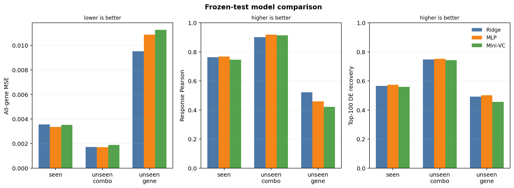
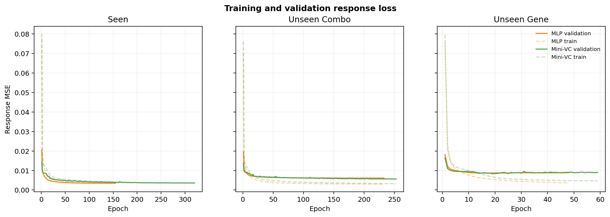
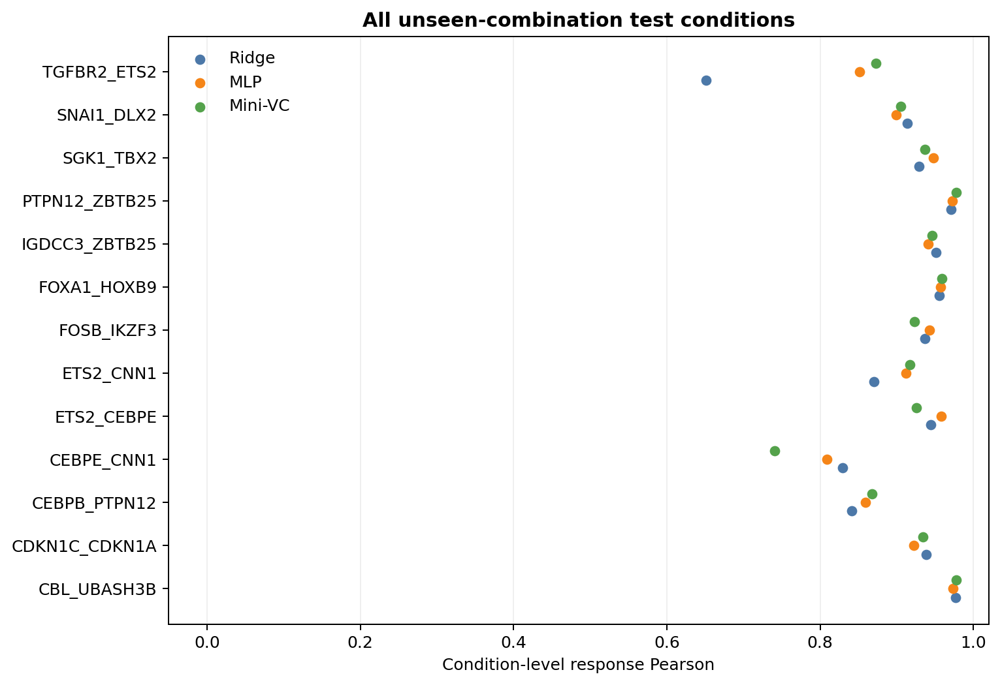
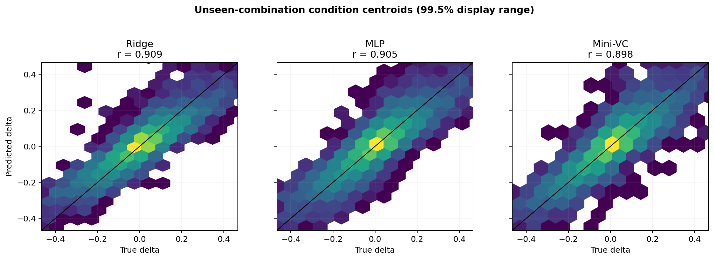
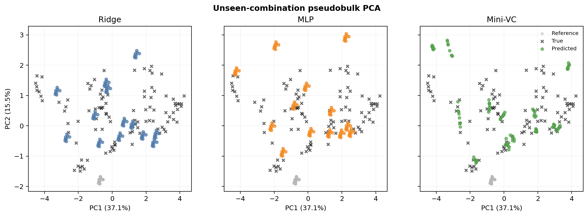
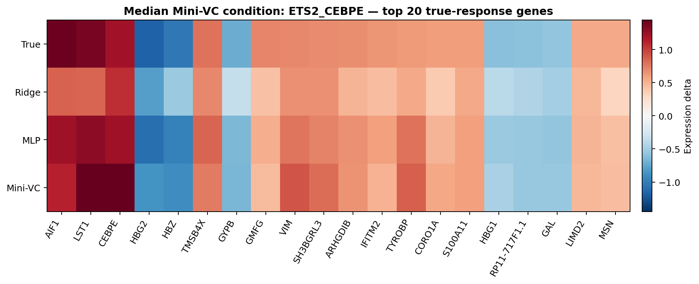

# 基础实验结果分析

本报告由保存的 test 预测和逐条件指标生成，分析过程不重新训练模型。

## 总体模型比较

Mini-VC 在三个拆分上均未稳定超过最佳简单基线。seen 中 MLP 更好；unseen-gene 中 Ridge 更好。Ridge 的表现与加性近似适合本任务的解释相容，但模型排名不能单独确定生物互作机制。

## 训练过程

seen 和 unseen-combination 的 validation loss 持续下降后进入平台期；unseen-gene 很早停止，符合 identity-only 表示无法学习全新基因语义的限制。

## Unseen-combination：主要泛化任务

测试集包含 13 个完整未见组合。按逐条件 response Pearson 计，获胜条件数为（0 个条件并列）：Ridge 4、MLP 3、Mini-VC 6。按 top-20 DE recovery 计（3 个条件并列，并列模型均计入）：Ridge 5、MLP 3、Mini-VC 9。

逐条件图展示全部测试组合，按名称排序。

散点图使用 condition-centroid expression delta，比较相对 control 的响应。
图标题中的 `r` 是把所有 condition×gene delta 合并后的 pooled correlation；主结果表使用逐 condition Pearson 的宏平均，所以两者数值不会完全相同。

## PCA

共同 PCA 的 PC1/PC2 分别解释 37.1% 和 15.5% 方差。PCA 展示整体表达空间的位置关系，不作为性能指标。

## 中位数条件的 DE 响应

选择规则是 Mini-VC response Pearson 排序后的中位数，而非最佳案例。选中条件为 `ETS2_CEBPE`，Mini-VC Pearson 为 0.926。

## 结论

在 unseen-combination 上，Mini-VC MSE 为 0.0019，response Pearson 为 0.914；MLP 分别为 0.0017 和 0.919。两者接近，Mini-VC 没有取得整体优势。这张表仅包含最初的 13 个测试组合；全部 131 个组合的结果见 [五折比较](scgpt_fivefold_results.md)。

基础测试集已在五折和 Reactome 实验前观察过，后两组比较属于同一数据集上的扩展分析。
